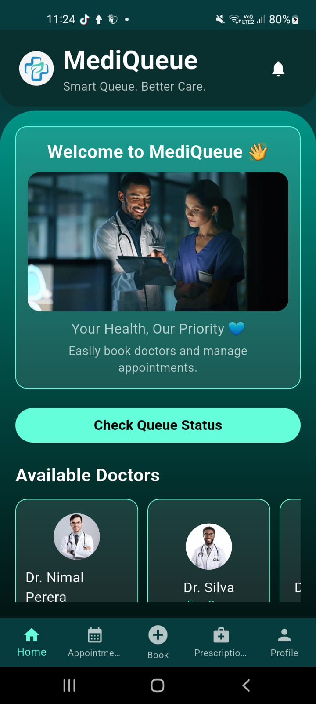
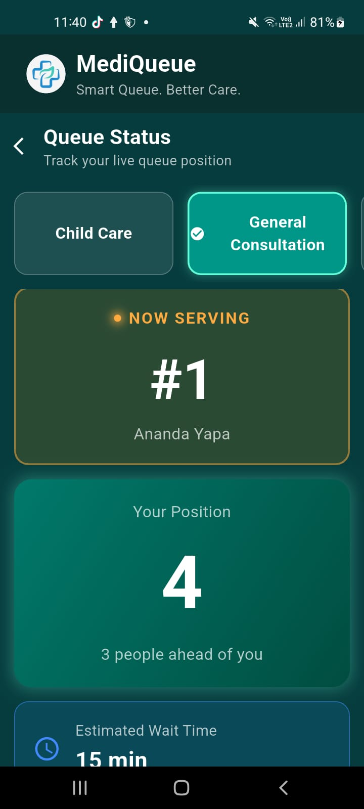

# 🏥 MediQueue - Smart Clinic Appointment & Queue Management System

## 📌 Project Overview

MediQueue is a smart clinic appointment and queue management mobile application developed to improve the efficiency of healthcare services and reduce patient waiting time.

The system allows patients to book appointments online, view their appointments, receive queue updates, and manage their profiles through a mobile application.

This mobile application was developed using **Flutter** with **Firebase backend services**.
---

# 🚀 Features

## 🔐 Authentication

- User registration
- User login
- Secure authentication using Firebase Authentication
- User profile management

---

## 👨‍⚕️ Appointment Management

- View available doctors
- Select medical services
- Book appointments
- Select preferred date and time
- View appointment history

---

## 🎫 Queue Management

- Generate queue number automatically
- View current queue status
- Track appointment progress
- Receive queue updates

---

## 👤 Patient Profile

- View personal details
- Update profile information
- Manage account details

---

# 🛠️ Technologies Used

| Technology | Purpose |
|------------|---------|
| Flutter | Mobile Application Development |
| Dart | Programming Language |
| Firebase Authentication | User Login & Registration |
| Cloud Firestore | Database Management |
| Firebase Cloud Messaging | Notifications |
| Android Studio | Development Environment |
| VS Code | Code Editor |
| GitHub | Version Control |

---

# 🏗️ System Architecture

MediQueue follows a client-server architecture.

### Mobile Application
- Developed using Flutter
- Provides patient-side features

### Backend Services
- Firebase Authentication
- Cloud Firestore Database
- Firebase services

---

# 📱 Screenshots


## Home Page



## Book Appointment


## Queue Status



---

# ⚙️ Installation & Setup

### 1. Clone Repository

```bash
git clone https://github.com/your-username/mediqueue-mobile.git
